<div align="center">

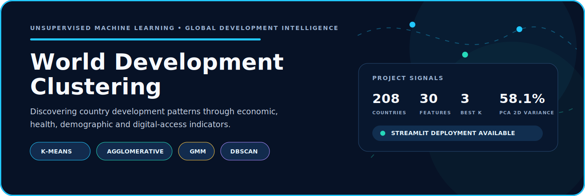 

<br/>

[](#technology-stack)
[](#modeling-strategy)
[](https://clusteringproakshay.streamlit.app/)
[](#deployment--product-experience)

### 🌍 A production-style unsupervised ML project for global development segmentation

**World Development Clustering** discovers meaningful country groups from economic, health, digital, demographic and environmental indicators—then turns those insights into an interactive Streamlit product.

<br/>

<a href="https://clusteringproakshay.streamlit.app/">

</a>

</div>

---

## 📌 Project Snapshot

| Dimension | Detail |
|---|---|
| **Problem Type** | Unsupervised Machine Learning / Country Segmentation |
| **Goal** | Group countries into meaningful development patterns without predefined labels |
| **Raw Dataset** | 2,704 rows × 25 columns |
| **Modeling Unit** | 208 country/economy profiles after aggregation |
| **Final Feature Space** | 30 features after feature engineering |
| **Algorithms** | K-Means, Agglomerative Clustering, DBSCAN, Gaussian Mixture Model |
| **Evaluation** | Silhouette Score, Davies-Bouldin Index, Calinski-Harabasz Score, PCA separation |
| **Deployment** | Interactive Streamlit dashboard with exploration and exports |
| **App Link** | [Open deployed app](https://clusteringproakshay.streamlit.app/) |

> **Core analytical idea:** There is no reliable target label such as “developed” or “developing” in the raw data. Instead of forcing a classification problem, this project lets multidimensional development indicators reveal natural country groupings.

---

## 🎯 Business Problem

Global development cannot be judged by GDP alone. Countries with similar economies may have very different patterns in:

- healthcare outcomes and investment,
- digital access and connectivity,
- population structure and urbanization,
- energy use and emissions,
- tourism and international integration.

### Analytical questions

1. Can countries be grouped into interpretable development segments using unsupervised learning?
2. Which indicators most clearly differentiate these groups?
3. Which clustering method balances statistical quality, coverage and stakeholder interpretability?
4. Can the analysis become a reusable product rather than remaining only a notebook?

---

## 🧠 Data-Scientist Thinking Behind the Project

| Phase | My Approach | Why It Matters |
|---|---|---|
| **Understand** | Investigated schema, missingness, distributions, correlation and outliers before modeling | Good clustering starts with a trustworthy feature space |
| **Prepare** | Cleaned formatted numeric columns, aggregated to country level, imputed missing values and scaled features | Distance-based algorithms are highly sensitive to raw-data quality |
| **Engineer** | Built interpretable development indicators such as GDP per capita and Digital Access | Makes final segments easier to explain |
| **Compare** | Benchmarked four clustering models instead of relying on one algorithm | Each model discovers a different structural view |
| **Validate** | Used metrics plus PCA visualization and cluster profiling | No ground-truth label exists, so validation must be multi-angle |
| **Deploy** | Saved the pipeline and built an interactive Streamlit dashboard | Converts analytical insight into stakeholder usability |

---

## 🗺️ End-to-End ML Architecture

<div align="center">
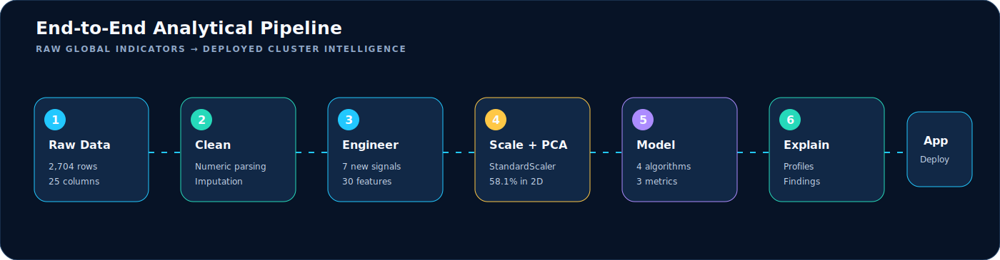
</div>

```text
Raw World Development Dataset
        ↓
Data-Type Audit + Numeric/Currency Cleaning
        ↓
Country-Level Aggregation
        ↓
Missing Value Treatment using Median Imputation
        ↓
Feature Engineering: Interpretable Development Signals
        ↓
StandardScaler + PCA Representation
        ↓
K-Means | Agglomerative | DBSCAN | GMM
        ↓
Model Evaluation + Cluster Profiling
        ↓
Serialized Pipeline + Streamlit Deployment
```

---

## 📊 Dataset Overview

The source dataset provides multi-year world-development observations covering economic, social, technological and environmental indicators.

### Feature families

| Dimension | Example Features | Analytical Role |
|---|---|---|
| **Economy** | GDP, Business Tax Rate, Lending Interest | Describes economic scale and operating environment |
| **Health** | Infant Mortality Rate, Life Expectancy, Health Expenditure | Indicates social outcomes and public-health maturity |
| **Digital Access** | Internet Usage, Mobile Phone Usage | Separates digitally connected environments |
| **Demographics** | Birth Rate, Youth / Elderly Population, Urban Population | Captures structural and urban-development patterns |
| **Energy & Environment** | CO2 Emissions, Energy Usage | Reveals industrial and sustainability intensity |
| **Tourism** | Tourism Inbound / Outbound | Adds mobility and global-integration context |

### Data-quality challenges handled

Several columns were stored as formatted strings rather than usable numeric values—for example `GDP`, `Health Exp/Capita`, `Tourism Inbound`, `Tourism Outbound`, and `Business Tax Rate`. The pipeline strips currency symbols, commas and percentage formatting before conversion to numeric values.

---

## 🧹 Data Preparation & Feature Engineering

### Preprocessing decisions

| Step | Implementation | Reason |
|---|---|---|
| **Numeric Cleaning** | Strip `$`, `%` and commas; convert values to numeric | Prevents invalid distance calculations |
| **Country Aggregation** | Aggregate multi-year records to mean country profiles | Country is the actual segmentation unit |
| **Missing Treatment** | Median imputation | More robust for skewed macroeconomic measures |
| **Scaling** | StandardScaler | Stops high-magnitude variables such as GDP from dominating |
| **Visualization Space** | PCA in 2D / 3D | Supports interpretable visual comparison of models |

### Engineered indicators

| Feature | Meaning | Value Added |
|---|---|---|
| `GDP_per_Capita` | GDP relative to population | Adjusts economic scale for country size |
| `Life_Exp_Gap` | Female vs male life-expectancy difference | Adds longevity-balance signal |
| `Life_Exp_Avg` | Combined life expectancy | Captures overall health outcome |
| `Health_Investment_Index` | Relative health expenditure intensity | Provides health-capacity context |
| `Youthfulness_Index` | Younger vs older population structure | Identifies demographic pressure |
| `Digital_Access` | Internet and mobile connectivity composite | Captures infrastructure access |
| `CO2_Intensity` | Emissions relative to energy use | Adds environmental-efficiency context |

> The final modeling feature space contains **30 features**, combining cleaned base variables and interpretable engineered signals.

---

## 🔍 Exploratory Data Analysis — Evidence That Guided Modeling

### 1. Correlation reveals a development structure

Strong relationships appear among health, demographic and economic dimensions. Highly correlated features include life expectancy patterns, birth-rate-related age structure, and the relationship between energy usage and emissions.

<div align="center">
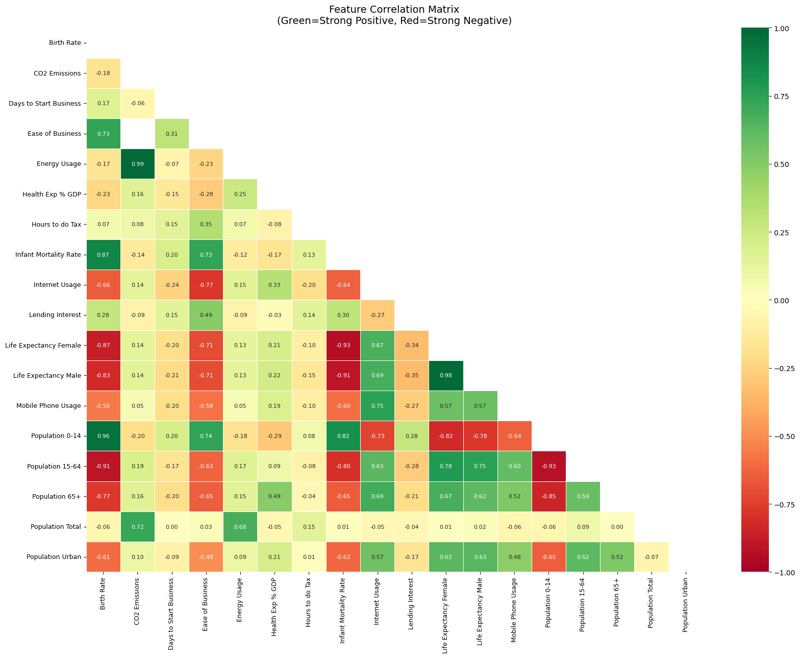
</div>

### 2. Scale and skew require careful preprocessing

Macroeconomic indicators vary greatly by country scale. Without standardization, variables such as GDP and emissions would dominate the distance function used by clustering methods.

### 3. Outliers may carry useful information

Certain economies can be highly unusual because of global scale, demographic structure or indicator imbalance. This is why DBSCAN was included as an anomaly-sensitive perspective rather than forcing every point into a broad group.

---

## 📉 PCA — Compressing the Feature Space for Visual Explanation

PCA was used to simplify the high-dimensional feature structure for model comparison and stakeholder communication.

| PCA Finding | Result |
|---|---:|
| First 2 components explain | **58.1%** of total variance |
| Components required for 90% variance | **11** |
| Components required for 95% variance | **15** |

<div align="center">
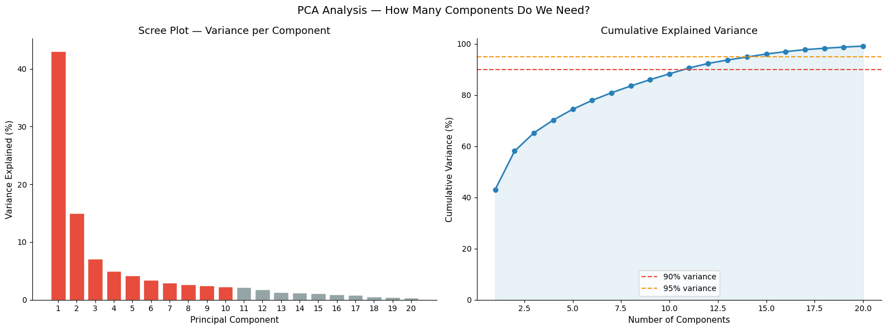
</div>

**Interpretation:** The first two components are valuable for visual storytelling, while a larger number of components is required to retain most of the underlying development information. This is a realistic sign of a genuinely multidimensional problem.

---

## 🤖 Modeling Strategy

Four algorithms were compared because clustering results depend heavily on model assumptions.

| Model | Why It Was Used | Strength | Limitation |
|---|---|---|---|
| **K-Means** | Establish a clear benchmark segmentation | Fast, intuitive and complete coverage | Requires K; favors compact groups |
| **Agglomerative Clustering** | Explore hierarchical development structure | Supports hierarchy-driven storytelling | Earlier merges cannot be undone |
| **DBSCAN** | Identify unusual / low-density economies | Finds outliers and irregular groups | Can mark too many records as noise |
| **Gaussian Mixture Model** | Test soft, probabilistic membership | Handles overlap better than hard centroids | Less simple to explain |

### Choosing the number of clusters

For K-Means, multiple candidate K values were assessed through inertia, Silhouette Score, Davies-Bouldin Index and Calinski-Harabasz Score.

> **Optimal K for K-Means = 3**, selected by the best Silhouette Score of **0.3201**.

<div align="center">
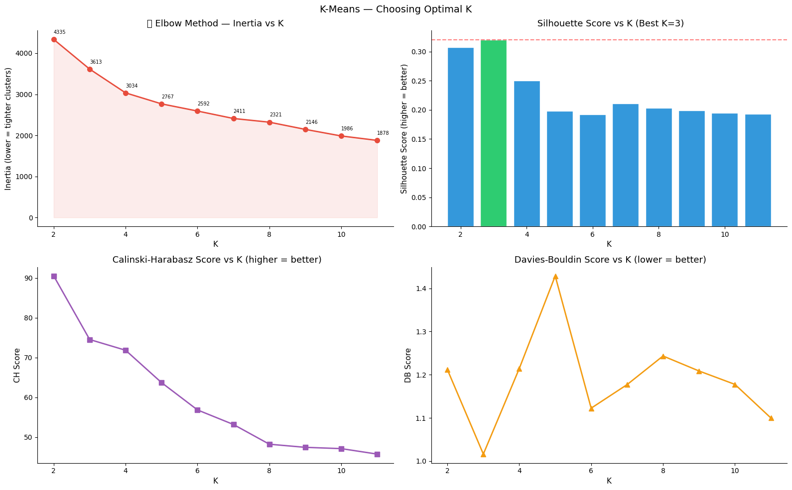
</div>

---

## 🏁 Model Evaluation & Decision

<div align="center">

</div>

| Model | Clusters | Noise | Silhouette ↑ | Davies-Bouldin ↓ | Calinski-Harabasz ↑ |
|---|---:|---:|---:|---:|---:|
| **K-Means** | 3 | 0 | 0.3201 | 1.0161 | 74.53 |
| **Agglomerative** | 3 | 0 | 0.3065 | 1.1285 | 68.64 |
| **DBSCAN** | 5 | 136 | **0.4514** | **0.7818** | **78.63** |
| **GMM** | 3 | 0 | 0.2681 | 1.3748 | 69.65 |

<div align="center">
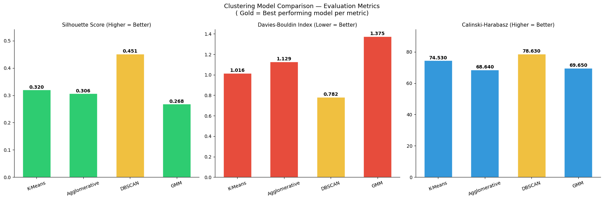
</div>

### The important trade-off

DBSCAN produces the strongest internal metrics, but it assigns **136 of 208 countries as noise**. That makes it highly useful for detecting unusual cases, yet too restrictive as the main country segmentation model.

### Final analytical recommendation

- **K-Means:** benchmark segmentation with full country coverage and strong interpretability.
- **Agglomerative:** strong hierarchical exploration model and a useful dashboard view.
- **DBSCAN:** anomaly/outlier lens, not the primary tiering model.
- **GMM:** supporting probabilistic view for overlapping development profiles.

> A statistically impressive clustering model is not automatically the most usable solution. Model quality must be evaluated alongside coverage, stability and explainability.

<div align="center">
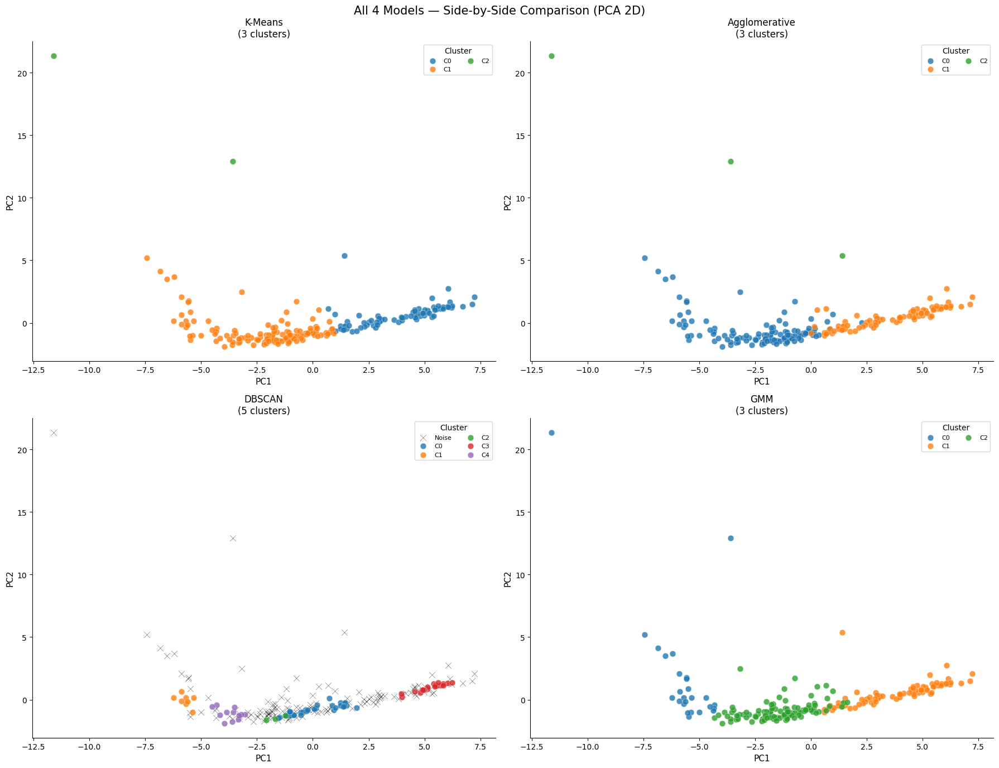
</div>

---

## 🧩 Cluster Profiling & Real-World Interpretation

K-Means with `K = 3` creates a complete benchmark segmentation for the 208 country profiles.

| Cluster | Countries | Avg Female Life Expectancy | Avg Infant Mortality | Avg Internet Usage | Interpretable Profile |
|---|---:|---:|---:|---:|---|
| **Cluster 0** | 77 | 60.3 years | 0.062 | 0.041 | Greater development constraints / lower access |
| **Cluster 1** | 129 | 77.9 years | 0.014 | 0.350 | Higher development / stronger digital access |
| **Cluster 2** | 2 | 77.8 years | 0.013 | 0.412 | Scale-dominant global economies |

### Notable finding: scale creates a distinct cluster

**China and the United States** are assigned to the dedicated two-country cluster. This suggests that large-scale indicators—such as overall GDP, energy use and emissions—differentiate these economies even when their health and digital-access profiles are mature.

<div align="center">
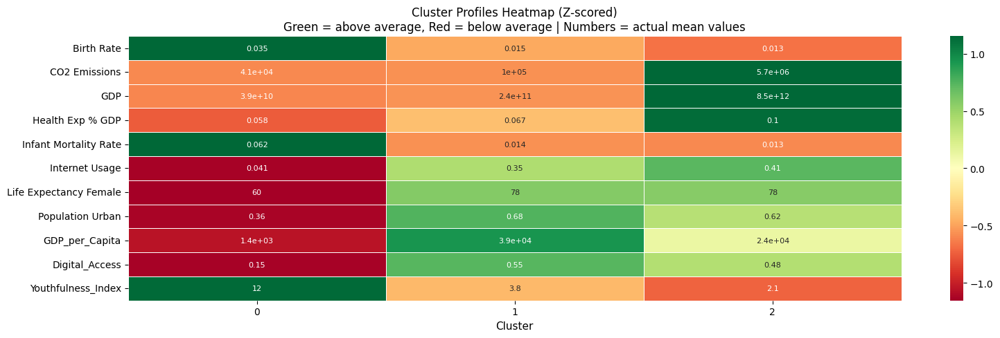

<br/><br/>

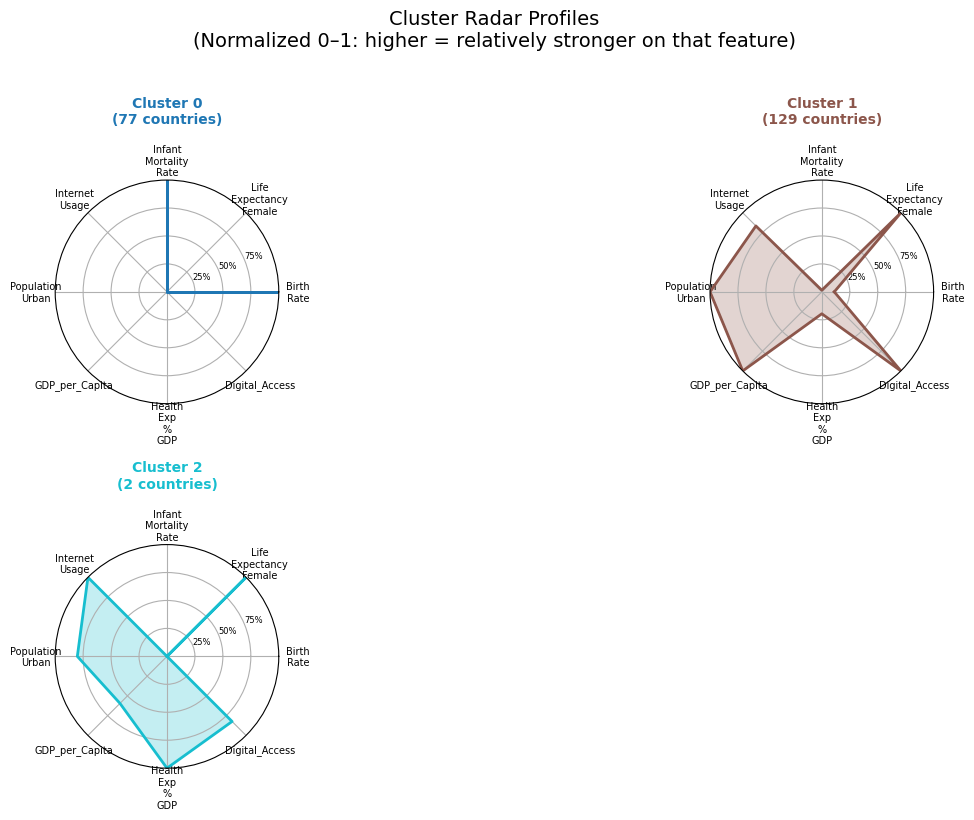
</div>

---

## 💡 Stakeholder-Ready Findings

| Finding | Why It Matters |
|---|---|
| **Development is multidimensional** | GDP alone is insufficient; health and digital-access indicators significantly improve interpretation. |
| **Digital access differentiates maturity** | Internet/mobile usage contributes to the split between connected and constrained profiles. |
| **Health outcomes strongly define tiers** | Life expectancy and infant mortality create clear contrast across clusters. |
| **Extreme scale changes similarity** | China and the United States behave as unique large-system economies in the benchmark model. |
| **Outliers deserve separate analysis** | DBSCAN identifies atypical economies that could merit focused research. |
| **Deployment increases usefulness** | The final output can be explored and exported by non-technical users. |

---

## 🚀 Deployment & Product Experience

### Deployment Link

🌐 **[Open the World Development Clustering Dashboard](https://clusteringproakshay.streamlit.app/)**

### What the application offers

| Feature | Functionality |
|---|---|
| **Built-in Pipeline Mode** | Loads the trained workflow automatically without mandatory upload |
| **Clustering Controls** | Supports model selection and K-based exploration |
| **Overview Tab** | Presents project objective, pipeline steps and loaded model components |
| **EDA / Clustering / Profiles** | Supports interactive insight exploration and interpretation |
| **Country Explorer** | Lets users search and inspect specific country outcomes |
| **Prediction Experience** | Enables model-driven input exploration where configured |
| **Download Center** | Provides clustered CSV, profile CSV, evaluation CSV and full Excel export |

### Application Preview

<div align="center">

#### Dashboard Landing View & Explorer

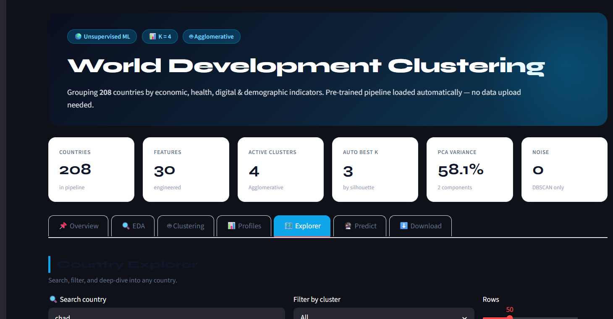

<br/><br/>

#### Pipeline Transparency & Loaded Model Objects

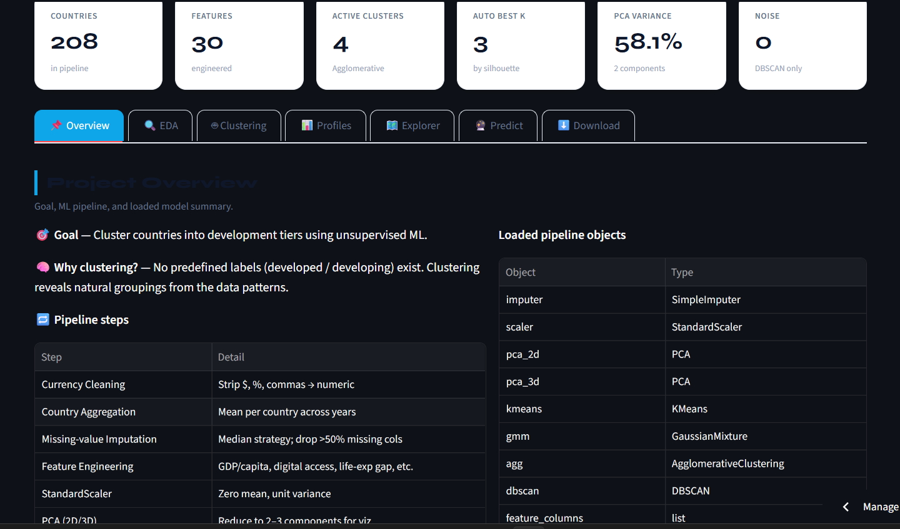

<br/><br/>

#### Exportable Clustered Outputs

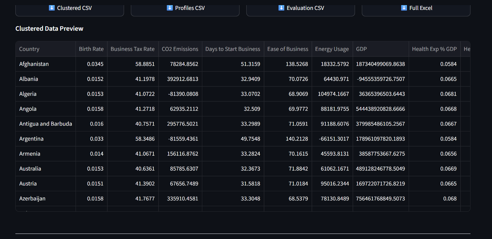

</div>

---

## 💾 Saved Pipeline & Deliverables

| Output | Purpose |
|---|---|
| `World_Development_Clustered.csv` | Country-level enriched dataset with assigned cluster labels |
| `Cluster_Profiles.csv` | Mean feature values per cluster for reporting and interpretation |
| `clustering_pipeline.pkl` | Serialized preprocessing objects, PCA components and trained models |

```python
pipeline_obj = {
    "imputer": imputer,
    "scaler": scaler_fe,
    "pca_2d": pca_2d,
    "pca_3d": pca_3d,
    "kmeans": kmeans,
    "gmm": gmm,
    "agg": agg,
    "dbscan": dbscan,
    "feature_columns": feature_cols,
    "optimal_k": optimal_k,
    "cluster_profile": cluster_profile
}
```

---

## 🧰 Technology Stack

| Area | Technologies |
|---|---|
| Data Analysis | Python, Pandas, NumPy |
| Visual Analytics | Matplotlib, Seaborn, Plotly |
| Preprocessing | SimpleImputer, StandardScaler |
| Dimensionality Reduction | Principal Component Analysis |
| Clustering | K-Means, Agglomerative Clustering, DBSCAN, Gaussian Mixture Model |
| Validation | Silhouette Score, Davies-Bouldin Index, Calinski-Harabasz Score |
| Hierarchical Analysis | SciPy Ward Linkage and Dendrogram |
| Serialization | Pickle |
| Deployment | Streamlit |
| Export Support | CSV and Excel |

---

## 📁 Repository Structure

```text
World-Development-Clustering/
│
├── app.py
├── requirements.txt
├── README.md
│
├── notebooks/
│   └── World_Development_Clustering_Enhanced.ipynb
│
├── data/
│   ├── raw/
│   │   └── World_development_measurement.xlsx
│   └── processed/
│       ├── World_Development_Clustered.csv
│       └── Cluster_Profiles.csv
│
├── models/
│   └── clustering_pipeline.pkl
│
└── assets/
    └── readme/
        ├── hero-banner.svg
        ├── pipeline-architecture.svg
        ├── deployment-cta.svg
        ├── model-decision-strip.svg
        ├── dashboard-hero.png
        ├── dashboard-pipeline-overview.png
        ├── dashboard-export-preview.png
        ├── correlation-heatmap.png
        ├── pca-variance-analysis.png
        ├── kmeans-optimal-k.png
        ├── model-comparison-metrics.png
        ├── pca-model-comparison.png
        ├── cluster-profile-heatmap.png
        └── cluster-radar-profiles.png
```

---

## ⚙️ Local Setup

### 1. Clone the repository

```bash
git clone <your-repository-url>
cd World-Development-Clustering
```

### 2. Create a virtual environment

```bash
python -m venv .venv
```

**Windows PowerShell**

```powershell
.venv\Scripts\Activate.ps1
```

**macOS / Linux**

```bash
source .venv/bin/activate
```

### 3. Install requirements

```bash
pip install -r requirements.txt
```

```txt
streamlit>=1.32.0
pandas>=2.0.0
numpy>=1.24.0
scikit-learn>=1.3.0
scipy>=1.10.0
plotly>=5.18.0
matplotlib>=3.7.0
seaborn>=0.12.0
openpyxl>=3.1.0
xlsxwriter>=3.1.0
```

### 4. Run the app locally

```bash
streamlit run app.py
```

---

## 🎤 Interview Explanation

> I developed an end-to-end unsupervised machine learning project to segment 208 countries using economic, health, digital-access and demographic indicators. I first cleaned formatted numeric fields and aggregated the multi-year data into country-level profiles. I then engineered seven interpretable features, standardized the feature space, used PCA to visualize structure and benchmarked K-Means, Agglomerative, DBSCAN and GMM using three clustering metrics. DBSCAN achieved the strongest internal scores, but marked most countries as noise, so I treated it as an outlier-detection lens rather than the primary segmentation solution. Finally, I deployed the pipeline through Streamlit so users can explore cluster outcomes and export analytical results.

---

## 🔮 Future Enhancements

- Add a world map colored by cluster assignment.
- Introduce cluster stability analysis using bootstrap resampling.
- Test log transformation and RobustScaler for highly skewed macroeconomic variables.
- Add year-based tracking to identify countries transitioning between segments.
- Generate automated executive PDF reports from the dashboard.
- Dockerize the application and add CI/CD deployment workflow.

---

## 👨‍💻 Author

**Akshay Rathod**  
*Data Science & Business Intelligence Portfolio Project*

🌐 **Deployment:** [World Development Clustering Dashboard](https://clusteringproakshay.streamlit.app/)

---

<div align="center">

### ⭐ Found this project insightful? Consider starring the repository.

<a href="https://clusteringproakshay.streamlit.app/">

</a>

</div>
